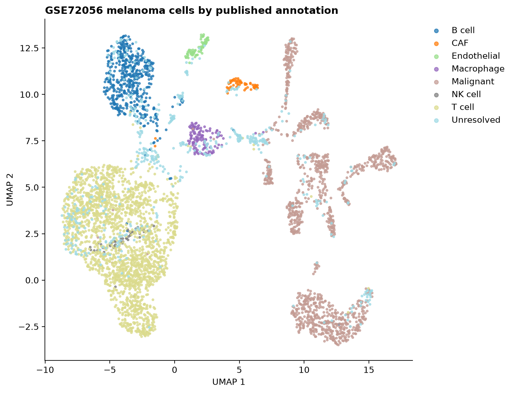
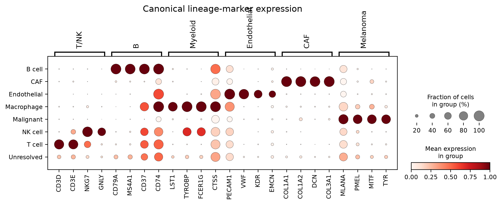
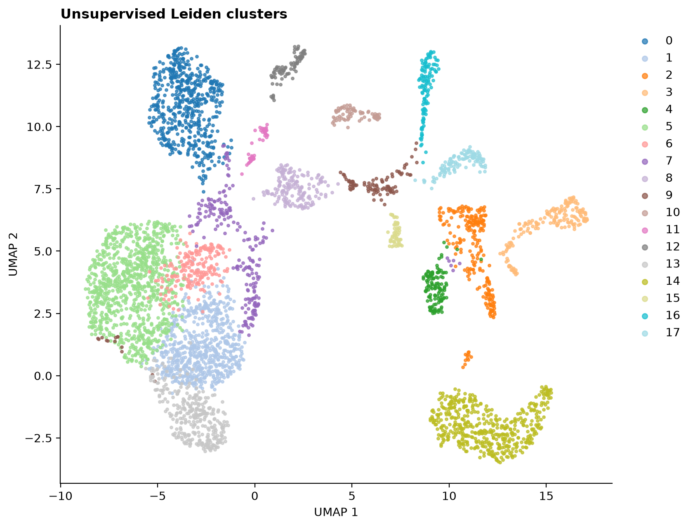

# Single-cell melanoma analysis (GSE72056)

A reproducible Python/Scanpy workflow for exploring malignant and non-malignant cell states in a public melanoma single-cell RNA-sequencing dataset.

## Dataset

- Accession: [GSE72056](https://www.ncbi.nlm.nih.gov/geo/query/acc.cgi?acc=GSE72056)
- Study: Tirosh et al., *Science* (2016)
- Input: the authors' revised processed single-cell expression matrix
- Scale: published log-transformed expression values

Because the public matrix is already processed, this workflow does **not** pretend to reconstruct raw UMI counts or repeat count normalization. Instead, it performs memory-conscious gene selection, dimensionality reduction, clustering, marker visualization, and cluster-level differential ranking.

## Workflow

1. Stream the compressed 75 MB matrix rather than loading every gene into memory.
2. Collect per-cell QC summaries and rank genes by variance.
3. Retain 1,500 variable genes plus canonical lineage markers.
4. Run PCA, nearest-neighbor graph construction, UMAP, and Leiden clustering in Scanpy.
5. Compare unsupervised clusters with the published cell annotations.
6. Rank cluster markers with Welch tests and Benjamini-Hochberg correction.
7. Export composition tables and publication-ready figures.

## Results snapshot

The verified run analyzed 4,645 cells from 19 patients, retained 1,510 variable/marker genes, and resolved 18 Leiden clusters. The close separation of published malignant and major stromal/immune annotations provides a useful visual check on the dimensionality-reduction workflow.







## Reproduce

```bash
python -m venv .venv
source .venv/bin/activate
pip install -r requirements.txt
python src/run_analysis.py
```

The script downloads the public GEO matrix automatically when `data/` is empty. To reuse an existing download:

```bash
python src/run_analysis.py --input /path/to/GSE72056_melanoma_single_cell_revised_v2.txt.gz
```

## Outputs

- `results/figures/umap_author_annotation.png`
- `results/figures/umap_leiden_clusters.png`
- `results/figures/marker_dotplot.png`
- `results/tables/top_markers_by_cluster.csv`
- `results/tables/cell_counts_by_annotation.csv`
- `results/tables/cluster_annotation_crosstab.csv`
- `results/analysis_summary.json`
- `results/software_versions.json`

The processed `.h5ad` file is generated locally under `data/processed/` and is intentionally excluded from version control.

## Scope and limitations

- This is an exploratory educational portfolio workflow, not a new biological discovery claim.
- Published annotations are used as reference labels, not treated as ground-truth predictions.
- The input matrix is processed expression; raw-read alignment and count-level QC are outside this repository's scope.
- Results depend on package versions and should be interpreted alongside the original study.

## License

Code is released under the MIT License. Data remain subject to NCBI GEO and original-study terms.
